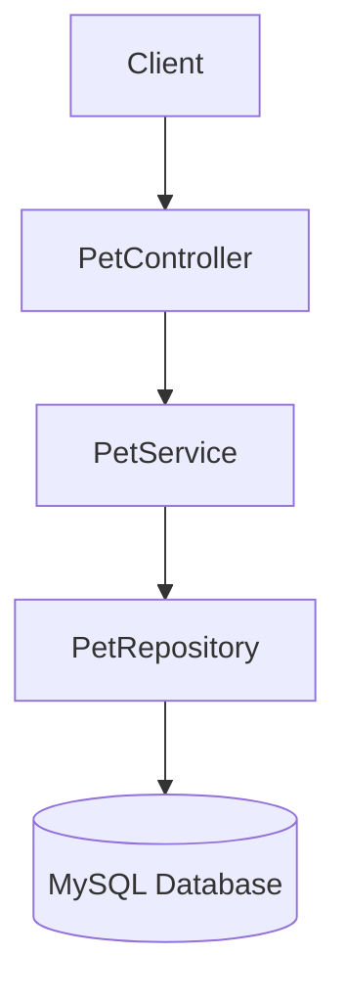

# Pet Adoption Catalogue API

## Description

The Pet Adoption Catalogue API is a Spring Boot REST application that uses Spring Data JPA to store and retrieve pet information from a MySQL database. It provides endpoints to retrieve, add and search for pets available for adoption.

## Technologies

- Java 25
- Spring Boot 4
- Spring Data JPA
- MySQL
- Lombok
- OpenAPI (Swagger)
- Maven

## Configuration

The application is configured using `src/main/resources/application.yml`.

```yaml
spring:
  application:
    name: petadoption

  datasource:
    url: jdbc:mysql://localhost:3306/pet_adoption
    username: root
    password: ${DB_PASSWORD}

  jpa:
    hibernate:
      ddl-auto: none
    show-sql: true

app:
  name: Pet Adoption Catalogue
```

## Running the Project

1. Clone the repository.
2. Create a MySQL database.
3. Open MySQL Workbench and run the SQL contained in:

```text
src/main/resources/database.sql
```

4. Configure the `DB_PASSWORD` environment variable with your MySQL password.
5. Run the Spring Boot application.

## OpenAPI Documentation

- Swagger UI: <http://localhost:8080/swagger-ui/index.html>
- OpenAPI specification: <http://localhost:8080/v3/api-docs>

## API Endpoints

| Method | Endpoint | Description |
|--------|----------|-------------|
| GET | `/pets` | Retrieves all pets |
| GET | `/pets/{id}` | Retrieves a pet by its ID |
| GET | `/pets/search?species=Cat` | Searches for pets by species |
| POST | `/pets` | Adds a new pet |

## Architecture



## Testing

The service layer is unit tested using JUnit 5 and Mockito.

The tests cover:

- Retrieving all pets
- Returning an empty list when no pets exist
- Adding a valid pet
- Rejecting a null pet
- Retrieving a pet by ID
- Handling a missing pet ID
- Searching for pets by species
- Returning an empty list when no matching species is found

Tests can be run using:

```bash
./mvnw test
```

## Java Concepts Demonstrated

### Streams

The `getPetsBySpecies()` method uses a stream and `filter()` to return pets matching the requested species.

```java
return pets.stream()
        .filter(pet -> pet.getSpecies().equalsIgnoreCase(species))
        .toList();
```

### Generics

The service contains a generic method that can accept different object types:

```java
public <T> boolean isNull(T item) {
    return item == null;
}
```

### Exception Handling

The application throws exceptions when invalid data is provided or a pet cannot be found.

A `try-catch` block is also used when saving a pet:

```java
try {
    return petRepository.save(pet);
} catch (Exception e) {
    log.error("Error saving pet", e);
    throw new RuntimeException("Unable to save pet", e);
}
```

### Logging

SLF4J logging is used throughout the service layer to record informational messages, warnings and errors.

## Future Improvements

Possible future improvements include:

- Updating existing pets
- Deleting pets
- Adding request validation
- Creating custom exception classes
- Adding a global exception handler