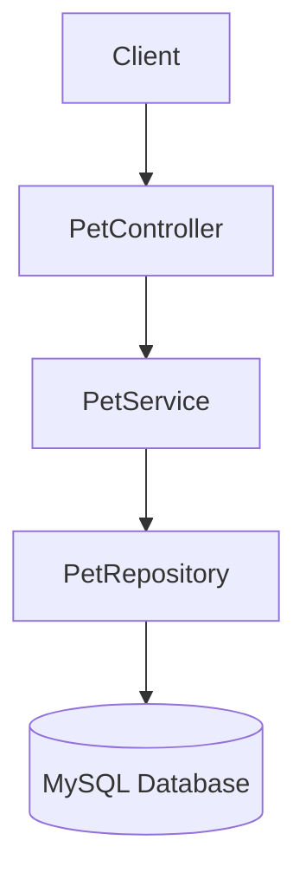

# Pet Adoption Catalogue API

## Description

The Pet Adoption Catalogue API is a Spring Boot REST application that uses Spring Data JPA to store and retrieve pet information from a MySQL database. 
It provides endpoints to retrieve, add and search for pets available for adoption.

## Technologies

- Java 25
- Spring Boot 4
- Spring Data JPA
- MySQL
- Lombok
- OpenAPI (Swagger)
- Maven

### Configuration

Update the following values in `src/main/resources/application.properties` if required:

```properties
spring.datasource.url=jdbc:mysql://localhost:3306/pet_adoption
spring.datasource.username=root
spring.datasource.password=${DB_PASSWORD}
```
The database password is read from the `DB_PASSWORD` environment variable.

The application name can also be changed by editing:

```properties
app.name=Pet Adoption Catalogue
```
## Running the Project

1. Clone the repository.
2. Create a MySQL database.
3. Open MySQL Workbench and run the SQL contained in:

```text
src/main/resources/database.sql
```

4. Configure the `DB_PASSWORD` environment variable with your MySQL password.
5. Run the Spring Boot application.

## OpenAPI Documentation

- Swagger UI: http://localhost:8080/swagger-ui/index.html
- OpenAPI specification: http://localhost:8080/v3/api-docs

## Architecture

